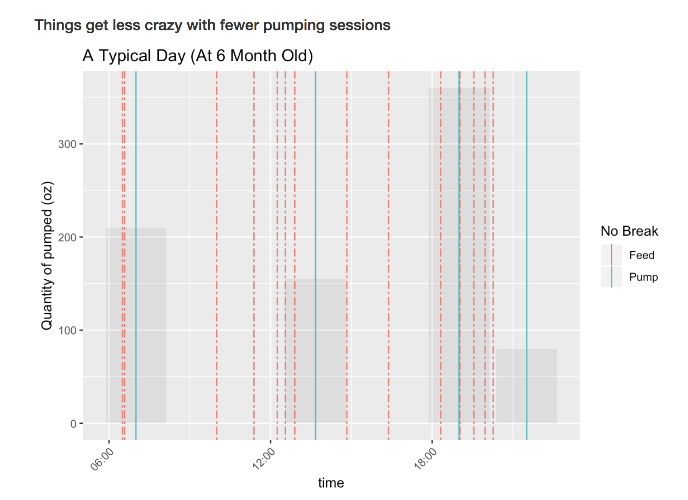

## Chronicling the journey of a pumping mom

We meticulously tracked our son's milk/formula intake, my pumping sessions, and his growth using the app Feed Baby (there are many others out there). Most data are daily, except growth.

Feed Baby allows you to download all the data you've entered. So I decided to create some plots to reflect on those early months. It certainly looked crazy. How did I ever get through it?

I'm sharing some screenshots of the "report" below. 

Full HTML can be downloaded in this repo (file was too large to be rendered here).

